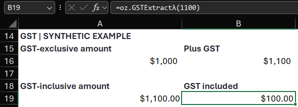

# Ozzit: see the GST arithmetic in Excel

Synthetic example. Review aid, not professional advice; the reviewer decides the GST treatment.

**Input:** $1,100, assumed wholly taxable and GST-inclusive at 10%.

Open [Ozzit v3.2.0](https://github.com/ryanduguid/Ozzit/releases/download/v3.2.0/ozzit.xlsx) in Microsoft 365 or Excel 2024 or later. No add-ins or macros.

```excel
=oz.GSTExtractλ(1100)
```

**Output:** $100.00 GST, reproduced in Microsoft 365. The hand calculation is $1,100 / 11.

**Human decision:** Does the evidence establish that the whole supply is taxable?


Captured in Microsoft 365 using Ozzit v3.2.0, Australian tax!A19:B19; the reviewer still decides whether the supply is taxable.

<details>
<summary>Setup, function catalogue, workbook examples and reference</summary>

A native Excel LAMBDA library for dynamic-array financial models, with inline help and editable demonstration worksheets under the `oz.` prefix. LibreOffice and older Excel versions cannot evaluate the functions.

## Capture evidence

The 6 September 2026 capture used Excel 16.0 build 20326. The released workbook opened without a repair prompt and a full calculation rebuild returned numeric 100 for the displayed formula.

Release asset SHA-256: `13df5eb0e2e7a3d1b17a743a990c30adfd187d409be133996ec154543e78ff28`.

The screenshot uses a disposable copy with a synthetic label, an explicit argument in B19 and currency formatting. It certifies this example in v3.2.0 only; it does not establish native verification of the different workbook on main. The shipped workbook was not edited.

## Guides

- [Open, copy functions and use modern Excel](docs/workbook-use.md)
- [Modules, worksheets and formula walkthroughs](docs/function-guide.md)
- [Australian conventions and lease modelling](docs/australian-modelling.md)
- [Separate 13-week cash-flow template](docs/cash-flow-template.md)
- [Function index](functions.csv) and [source views](src/)

## Verification and attribution

The tagged repository release is [v3.2.0](https://github.com/ryanduguid/Ozzit/releases/tag/v3.2.0), dated 30 August 2026; citation metadata is in [CITATION.cff](CITATION.cff).

- [Repository checks](AGENTS.md) and [release and native verification](RELEASING.md)
- [Changes](CHANGELOG.md) and [citation](CITATION.cff)

MIT licensed. See [LICENCE](LICENCE) and [ATTRIBUTION.md](ATTRIBUTION.md) for predecessor and transformation provenance.

</details>
