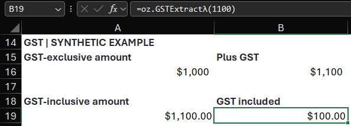

# Ozzit: Excel LAMBDA functions for Australian financial modelling

[](https://github.com/ryanduguid/Ozzit/actions/workflows/verify.yml)
[](https://github.com/ryanduguid/Ozzit/actions/workflows/codeql.yml)
[](https://github.com/ryanduguid/Ozzit/releases/latest)
[](LICENCE)
[](https://app.codacy.com/gh/ryanduguid/Ozzit/dashboard)


One Excel workbook holding 137 native LAMBDA functions and 5 named help tables under
the `oz.` prefix: amortisation, depreciation, ratios, AASB 16 lessee schedules, and
Australian GST and financial-year helpers. The functions need no add-in, macro, VBA or
external dependency, so a copied function travels inside your own file and a reviewer
can read the arithmetic. The file carries a hidden reference to the Advanced Formula
Environment task pane used to author the functions; the functions do not depend on
it. It suits an accountant or analyst modelling in Excel; it is not a
bookkeeping tool and never touches a ledger.

**Needs Microsoft 365 or Excel 2024 or later**, which support `LAMBDA` and dynamic
arrays. LibreOffice, Google Sheets and earlier Excel versions cannot evaluate the
functions. MIT licensed.

**Current published release: [v3.4.2](https://github.com/ryanduguid/Ozzit/releases/tag/v3.4.2)**,
published 20 September 2026 from the cut dated 16 September 2026.
[Download ozzit.xlsx](https://github.com/ryanduguid/Ozzit/releases/download/v3.4.2/ozzit.xlsx)
(439,097 bytes, SHA-256 `0306793a7e473ce70e78149fea1e107fc0f714d61ab50960c16f6fd528878f6f`).

**Known issues in v3.4.2.** One blank cell in a column of GST rates gives every row
10%, zero-rated rows included; one blank opening in `oz.Movementλ` sets every row's
opening to 0; and negative CFADS raises the balance in `oz.DebtSculptFixedλ` and
`oz.DebtSculptVariableλ`. One blank cell likewise gives every row the default in a
column of PeriodsPerYear for `oz.PeriodRateλ` and `oz.AnnualRateλ`, of Unit for
`oz.DateDifλ` and of Repeats for `oz.IsOccurrenceDateλ`, whose LastOccurrence column
reads no text date once another row holds a date or a blank. In v3.4.2, fill every such
cell and enter last occurrences as dates. All of these are fixed on `main` for the next
release. Further changes and the DB/DDB compatibility limitations are recorded
under [Unreleased in the changelog](CHANGELOG.md#unreleased).

Synthetic example. Review aid, not professional advice; the reviewer decides the GST treatment.

**Input:** $1,100, assumed wholly taxable and GST-inclusive at 10%.

```excel
=oz.GSTExtractλ(1100)
```

**Output:** the cell displays $100.00 GST under currency formatting, reproduced in
Excel 16.0 build 20430 against the exact v3.4.2 release on 25 September 2026.
[Inputs, raw results and unchanged workbook hash](docs/reference-examples-v3.4.2.json).
The function returns the unrounded binary-float result,
99.999999999999986, so a caller who needs cent-exact totals wraps it in
`ROUND(...,2)`. The hand calculation is $1,100 / 11.

**Human decision:** Does the evidence establish that the whole supply is taxable?

[Browse ten worked formulas](https://duguid.com.au/tools/ozzit/#functions),
including arguments, expected results and limits for v3.4.2.

<details>
<summary>Historical v3.2.0 screenshot</summary>


Captured in Microsoft 365 using Ozzit v3.2.0, Australian tax!A19:B19; the reviewer still decides whether the supply is taxable.

This earlier image is retained as historical evidence. The current numerical
check above used a different workbook file.

</details>

## Start with three tasks

You do not need all 137 functions. Most models start with one of these three.
The loan and depreciation guides show the spilled result for a synthetic input
you can check by hand; the lease guide explains the four lessee functions.

| Task | Formula | Guide |
| --- | --- | --- |
| Loan schedule | `=oz.Amortiseλ(Principals, APRs, Terms, StartDates)` | [100,000 at 5% over 60 months](docs/function-guide.md#dynamic-array-formula-walkthrough) |
| Depreciation | `=oz.DiminishingValueλ(Cost, Life)` | [1,000 over 5 years](docs/function-guide.md#dynamic-array-formula-walkthrough) |
| AASB 16 lease | `=oz.LeaseScheduleλ(Payments, Rate, [InAdvance])` for the liability, `=oz.ROUScheduleλ(Cost, Periods)` for the right-of-use asset | [Lessee functions and rate conversion](docs/australian-modelling.md#aasb-16-leases) |

[Open, copy functions and use modern Excel](docs/workbook-use.md) shows how to
copy a function into your own workbook.

<details>
<summary>Setup, function catalogue, workbook examples and reference</summary>

A library of 137 native Excel LAMBDA functions plus 5 named help tables for dynamic-array financial models, with inline help and editable demonstration worksheets under the `oz.` prefix. LibreOffice and older Excel versions cannot evaluate the functions.

## Capture evidence

The 6 September 2026 capture used Excel 16.0 build 20326. The released workbook opened without a repair prompt and a full calculation rebuild returned numeric 100 for the displayed formula.

v3.2.0 release asset SHA-256: `13df5eb0e2e7a3d1b17a743a990c30adfd187d409be133996ec154543e78ff28`.

The [capture record and PowerShell reproduction](docs/native-gst-capture.md) preserve the Excel command, returned value, crop and image fingerprint.

The screenshot uses a disposable copy with a synthetic label, an explicit argument in B19 and currency formatting. It certifies this example in v3.2.0. The v3.4.2 workbook is a different file; its full native gate results are recorded in its release notes and in [CHANGELOG.md](CHANGELOG.md). The shipped workbook was not edited.

## Guides

- [Open, copy functions and use modern Excel](docs/workbook-use.md)
- [Modules, worksheets and formula walkthroughs](docs/function-guide.md)
- [Australian conventions and lease modelling](docs/australian-modelling.md)
- [Separate 13-week cash-flow template](docs/cash-flow-template.md)
- [Comparing a modelling schedule with an accounting carrying amount](docs/depreciation-comparison.md)
- [Ratio definitions: the arithmetic, periods and balances each ratio expects](docs/ratio-definitions.md)
- [Modelling conventions: where Ozzit follows or departs from the FAST Standard and the ICAEW Financial Modelling Code](docs/modelling-conventions.md)
- [Function index](functions.csv), [source views](src/) and the whole library as one Advanced Formula Environment module, [oz.txt](oz.txt)

## Verification and attribution

The current release is v3.4.2, dated 16 September 2026; citation metadata is in [CITATION.cff](CITATION.cff). It was published on 20 September 2026 from the signed tag `v3.4.2` on commit `621af0e265306f00a83e17c4d27dca09031c5ccd`, after the native gates [RELEASING.md](RELEASING.md) requires ran on the exact file it ships. The [release page](https://github.com/ryanduguid/Ozzit/releases/tag/v3.4.2) carries `ozzit.xlsx`, `provenance.json` and `SHA256SUMS`, and GitHub reports the release immutable.

v3.4.2 `ozzit.xlsx` SHA-256: `0306793a7e473ce70e78149fea1e107fc0f714d61ab50960c16f6fd528878f6f` (439,097 bytes), the same bytes as the release asset. `main` is ahead of that tag, so the file you clone is not the file the release ships: the tracked `ozzit.xlsx` is SHA-256 `8c42e2278de61bdacfb090b940e684bb12a7636a256816aa20f81360b71bb760` (452,439 bytes), pinned in [release/workbook-base.json](release/workbook-base.json) and checked by the tool tests. On 29 September 2026, Excel 16.0 build 20430 recalculated 1,129 formulas with 0 in error, ran 1,033 self-test assertions with 0 failures and found 19,446 cached values equal to what their formulas produce. The workbook was byte-identical before and after both native gates.

- [Repository checks](AGENTS.md) and [release and native verification](RELEASING.md)
- [Changes](CHANGELOG.md) and [citation](CITATION.cff)

MIT licensed. See [LICENCE](LICENCE). [DISCLAIMER.md](DISCLAIMER.md) states that this is not advice and names the bodies the project is not affiliated with.

</details>
